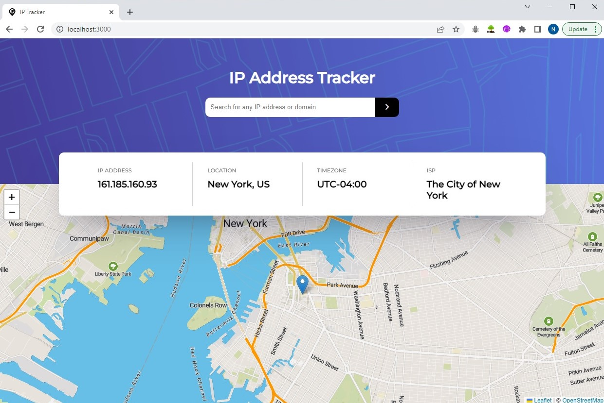

<!-- PROJECT LOGO -->
 

  

  <h3 align="center">IP Tracker Application</h3>

  

    This application allow users to search any IP address or domain and see its key information and location
     
    <a href="https://github.com/NaweedAhmadi/ipTracker"><strong>Explore the docs »</strong></a>
     
     
    <a href="#">View Demo</a>
    ·
    <a href="https://github.com/NaweedAhmadi/ipTracker/issues">Report Bug</a>
    ·
    <a href="https://github.com/NaweedAhmadi/ipTracker/issues">Request Feature</a>
  

<!-- ABOUT THE PROJECT -->
## About The Project

  

 

## The challenge

This is a solution to the IP address tracker challenge on Frontend Mentor.

 
Your challenge is to build out this IP Address Tracker app and get it looking as close to the design as possible. To get the IP Address locations, you'll be using the IP Geolocation API by IPify. To generate the map, we recommend using LeafletJS.
 
You can use any tools you like to help you complete the challenge. So if you've got something you'd like to practice, feel free to give it a go.
 
Your users should be able to:
 
* View the optimal layout for each page depending on their device's screen size
* See hover states for all interactive elements on the page
* See their own IP Address on the map on the initial page load
* Search for any IP addresses or domains and see the key information and location

Of course, no one template will serve all projects since your needs may be different. So I'll be adding more in the near future. You may also suggest changes by forking this repo and creating a pull request or opening an issue. Thanks to all the people have contributed to expanding this template!

Use the `BLANK_README.md` to get started.

(<a href="#readme-top">back to top</a>)

